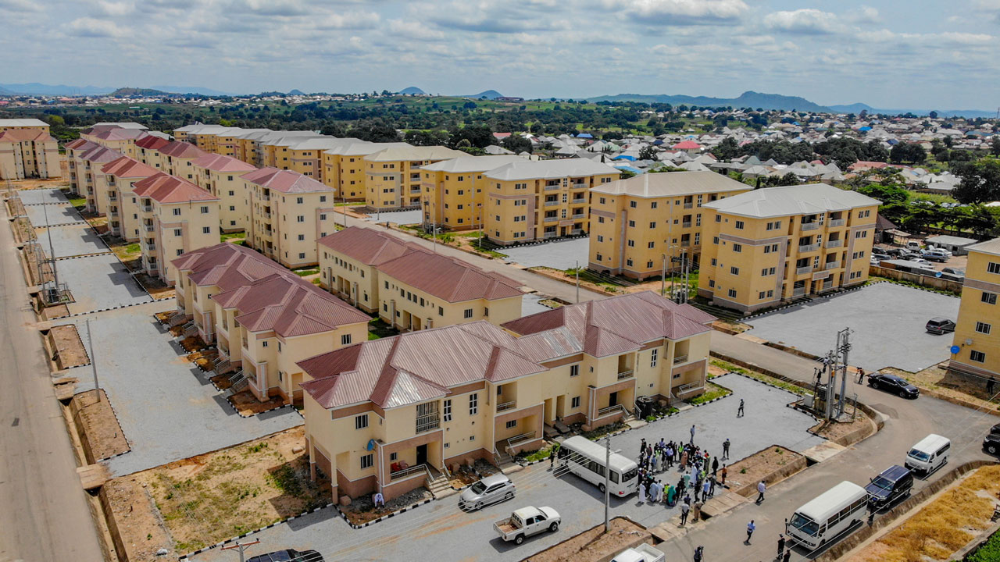
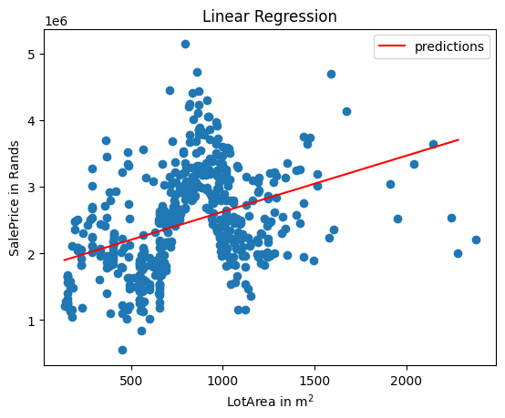
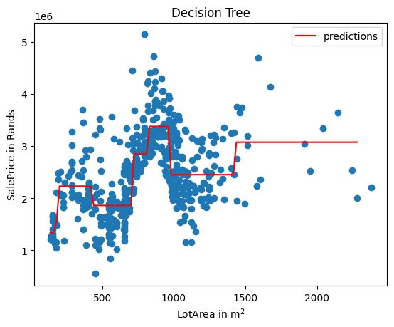
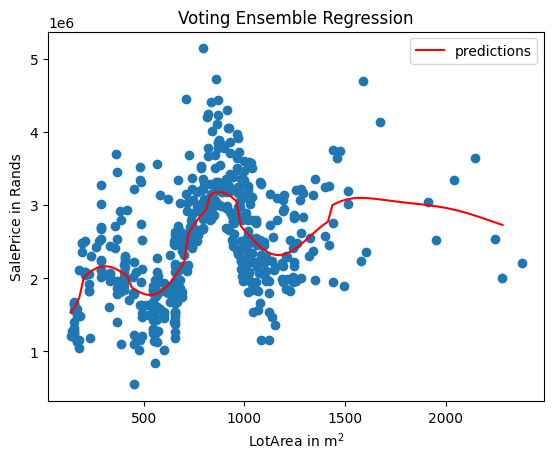
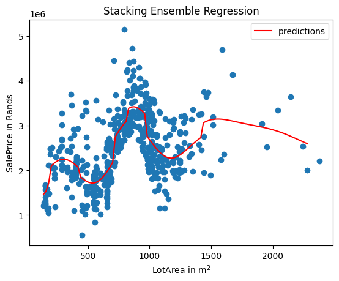
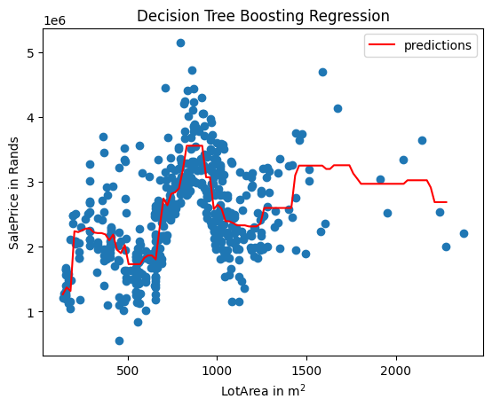

# **HOUSE PRICES PREDICTION**  
**_Heterogeneous and Homogeneous Ensemble Methods_**  



## **INTRODUCTION**  
Predicting house prices is a critical task in **real estate valuation and investment analysis**. This project applies **Heterogeneous and Homogeneous Ensemble Methods** to improve prediction accuracy by leveraging multiple models.  

Using ensemble learning techniques like **Voting, Stacking, Bagging, and Boosting**, we enhance model performance and robustness.  

---

## **PROBLEM STATEMENT**  
House prices are influenced by various factors, making them **challenging to predict accurately**.  
This project aims to:  
- **Compare different ensemble learning techniques** for regression.  
- **Evaluate the effectiveness of heterogeneous (different models) and homogeneous (same base model) ensembles**.  
- **Identify the best-performing model** for predicting house prices.  


---

## **SKILL DEMONSTRATION**  
- **Data Preprocessing & Feature Engineering**  
- **Heterogeneous Ensemble Methods**: Voting & Stacking  
- **Homogeneous Ensemble Methods**: Bagging & Boosting  
- **Model Performance Evaluation** (MSE, RMSE, R² Score)  
- **Hyperparameter Tuning & Model Optimization**  

---

## **DATA SOURCING**  
The dataset contains **house price data**, including various predictors such as:  
- **Size & Location**: Square footage, number of bedrooms/bathrooms, neighborhood.  
- **Market Factors**: Property age, market conditions, interest rates.  
- **Structural Features**: Lot size, garage space, additional amenities.  

---

## **ENSEMBLE METHODS EXPLAINED**  
This project implements **two types of ensemble learning techniques**:  

### **1. Heterogeneous Ensembles**  
Heterogeneous ensembles combine **different types of models** to enhance performance.

Linear Regression          | Decision Trees               | Support Vector
:-------------------------:|:----------------------------:|:-----------------------:
  |  | 

#### **A. Voting Regressor**  
- Uses multiple base models (Linear Regression, Decision Tree, SVR).  
- Aggregates predictions by **averaging outputs**.  
```python
from sklearn.ensemble import VotingRegressor
ensemble = VotingRegressor(estimators=[('lr', lin_reg), ('dt', tree), ('svr', svr)])
ensemble.fit(X_train, y_train)
```


#### **B. Stacking Regressor**  
- Uses multiple base models & a **meta-model** for final predictions.  
```python
from sklearn.ensemble import StackingRegressor
meta_model = RandomForestRegressor()
ensemble = StackingRegressor(estimators=[('lr', lin_reg), ('dt', tree), ('svr', svr)], final_estimator=meta_model)
ensemble.fit(X_train, y_train)
```



---

### **2. Homogeneous Ensembles**  
Homogeneous ensembles use **the same base model** but apply different training strategies.  

#### **A. Bagging (Bootstrap Aggregation)**  
- Trains multiple **Decision Trees** on different random subsets of data.  
```python
from sklearn.ensemble import BaggingRegressor
ensemble = BaggingRegressor(base_estimator=DecisionTreeRegressor(), n_estimators=100, random_state=42)
ensemble.fit(X_train, y_train)
```


#### **B. Boosting (Gradient Boosting & AdaBoost)**  
- **Boosting corrects errors** from previous models by adjusting weights.  
```python
from sklearn.ensemble import GradientBoostingRegressor
ensemble = GradientBoostingRegressor(n_estimators=100, learning_rate=0.1)
ensemble.fit(X_train, y_train)
```


---

## **MODEL EVALUATION**  
Each model was evaluated using:  
- **Mean Squared Error (MSE)**  
- **Root Mean Squared Error (RMSE)**  
- **R² Score (Coefficient of Determination)**  
- **Cross-validation** for performance consistency.  

```python
from sklearn.metrics import mean_squared_error, r2_score

y_pred = ensemble.predict(X_test)
mse = mean_squared_error(y_test, y_pred)
r2 = r2_score(y_test, y_pred)
```

---

## **KEY FINDINGS**  
- **Stacking Regressor outperformed Voting Regressor**, showing the benefit of learning from multiple models.  
- **Gradient Boosting was the best-performing homogeneous ensemble**, surpassing Bagging.  
- **Boosting techniques consistently improved model accuracy** by reducing errors.  

---

## **HOW TO RUN THE PROJECT**  
### **1. Prerequisites**  
Ensure you have Python installed along with the required libraries:  
```bash
pip install numpy pandas seaborn matplotlib scikit-learn
```
### **2. Clone the Repository**  
```bash
git clone https://github.com/yourusername/House-Prices-Prediction-Ensembles.git
cd House-Prices-Prediction-Ensembles
```
### **3. Run the Jupyter Notebooks**  
```bash
jupyter notebook Heterogeneous_ensemble_methods_examples.ipynb
jupyter notebook Homogeneous_ensemble_methods_examples.ipynb
```
